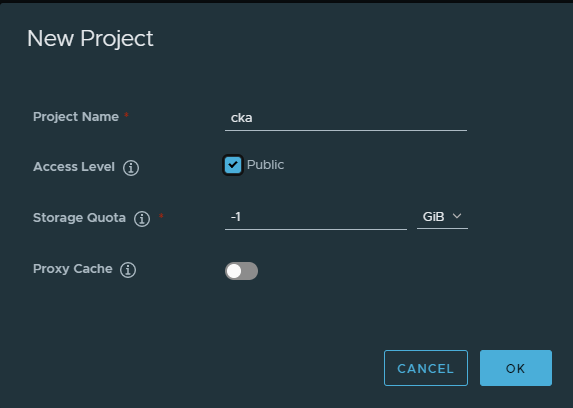
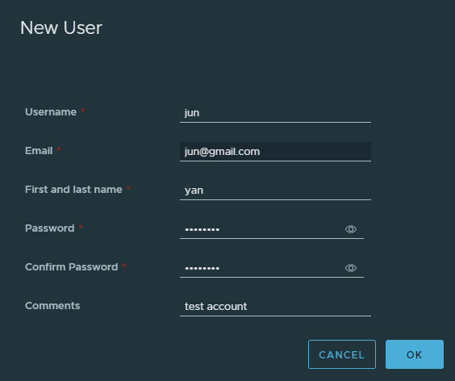
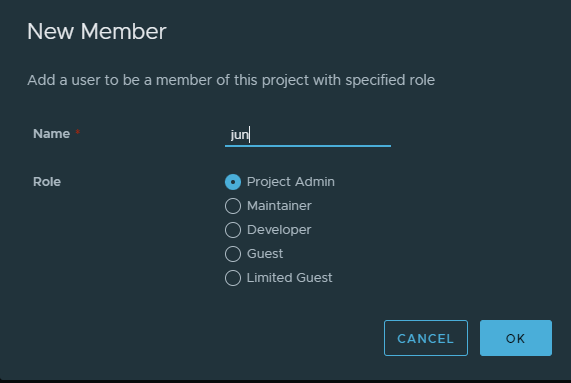

# Install Harbor
## Check the prerequest of your PC
- https://goharbor.io/docs/2.6.0/install-config/installation-prereqs/

## Download harbor package from github
- Github Release Page: https://github.com/goharbor/harbor/releases
- We use the currently latest release version 2.6.0
    - Download Package
    ```commandline
    $> wget https://github.com/goharbor/harbor/releases/download/v2.6.0/harbor-offline-installer-v2.6.0.tgz
    $> tar zxvf harbor-offline-installer-v2.6.0.tgz
    ```
## Apply self-signed certificate
- ref: https://goharbor.io/docs/2.6.0/install-config/configure-https/
```commandline
$> bash create_certificate.sh  # will create two folder ca_side/ and server_side/
```

## Set Hosts
- for windows: add "myharbor" in C:\Windows\System32\drivers\etc\hosts
- for ubuntu: add "myharbor" in /etc/hosts

## Config YAML
```
$> cd harbor
$> cp harbor.yml.tmpl harbor.yml
$> vim harbor.yml
```
Something you can modify in harbor.yml
1. Use https, you need to modify the path of certificate generated by previous step:
    - `certificate: /data/cert/myharbor.crt`
    - `private_key: /data/cert/slave.key`
2. Set admin password `harbor_admin_password: Harbor12345`
3. Set Hostname `hostname: myharbor`

## Run Prepare
```commandline
$> ./prepare
```    

## Run Install
```commandline
$> sudo ./install.sh
```

## Create a Project and a test User
1. Login with admin and create project named cka

2. Create a test user named jun

3. Add jun in cka project


## Push your first image
```commandline
# login with jun account in our registry
$> docker login myharbor:443

# Pull the mysql image and push on our registry
$> docker pull mysql:latest
$> docker tag mysql:latest myharbor:443/cka/mysql:v1
$> docker push myharbor:443/cka/mysql:v1
```

## Private Harbor registry Access by Client
- ref: https://docs.docker.com/registry/insecure/
- Download `myharbor.crt` in Client
  ```
  $> multipass transfer master:server_side/myharbor.crt .
  ```
- Right click `myharbor.crt` and select Trusted Root Certificate Authorities
- Restart Docker Desktop
- Add "registry_ip  myharbor" in host
```commandline
$> docker pull myharbor:443/cka/mysql:v1
```
