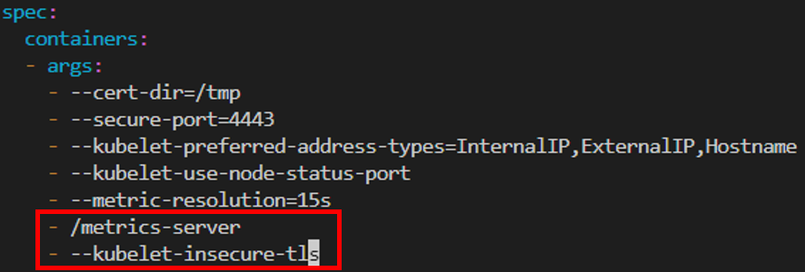

# Install K8S Cluster with Kubeadm

## Prerequest
Please read this article first: https://medium.com/p/f3528b8154aa

## Install VMs
```commandline
$> ./setup_k8s_cluster.ps1 3  # create 3 nodes, the first one is master node, the others are slave nodes 
```

## Add slave node into cluster
show the join token by running the following command
```commandline
$> ./setup_k8s_cluster.ps1  # Please do not assign any number
```  
then please use the join token to add slave into cluster
```
# login slave1
$> multipass exec slave1 -- bash
slave1@host> sudo kubeadm join 172.21.155.63:6443 --token xv6u5e.oiot6asc9lbkkyy1 --discovery-token-ca-cert-hash sha256:53781aaf53ddbbc8c5591d91b2ec4d8539e2924e83e92ed06bb94e303b54d19a --cri-socket=/run/cri-dockerd.sock
```

## Install metrics-server in cluster
After installing the metric-server, we can use `kubectl top nodes` to monitor resource usage of nodes in cluster. More detail can find [here](https://github.com/kubernetes-sigs/metrics-server).
- Install metrics-server
    ```commandline 
    $> kubectl apply -f https://github.com/kubernetes-sigs/metrics-server/releases/latest/download/components.yaml
    ```
- Monitor resource usage of nodes
    ```commandline
    $> kubectl top nodes
    ```

## Remove VMs
- remove one VM
```commandline
$> multipass delete --purge <VM_name>
```
- remove all VMs
```commandline
$> multipass delete --purge --all
```

## Troubleshooting
1. Bad Certificate
    Error raise when runing `kubectl top nodes`
    - Check kubelet log
        ```commandline
        $> journalctl -f -u kubelet
        ```
        the kubectl log show the error raise by bad certificate
        
    - How to fix
        ```commandline
        $> kubectl edit deploy metrics-server -n kube-system
        ```
        Modify the containers args
         \
        Wait a few seconds, you can use the `kubectl top nodes` normally.