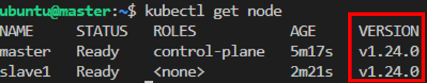
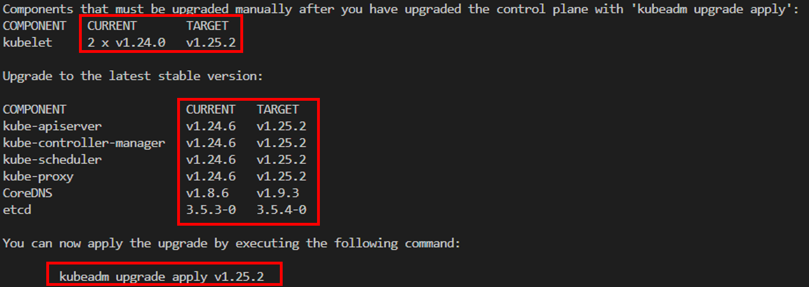

# Upgrade K8s
Goal: Upgrade k8s 1.24.0 to k8s 1.25.2

## Kubernetes versions 
- K8S versions are expressed as x.y.z, where x is the major version, y is the minor version, and and z is the patch version
- Skipping MINOR versions when upgrading is unsupported. That is, we can only upgrade from 1.24.x to 1.25.x but not from 1.23.x to 1.25.x. Because skipping minor version is not allowed.
- Release History: https://kubernetes.io/releases/
- Official Document for upgrading k8s: https://v1-21.docs.kubernetes.io/docs/tasks/administer-cluster/kubeadm/kubeadm-upgrade/ 

## Hands-on
1. Install K8S 1.24.0
    ```bash
    # install cluster with 2 nodes
    $> .\setup_k8s_v1.24.0-00.ps1 2
    ```
    After installing, please run join token in slave node.
    Now, check the installed k8s version
    ```bash
    $> multipass exec master -- bash
    master $> kubectl get node
    ```
    

2. Upgrade Master \
    - For node: you need to upgrade the master first and then upgrade the slave
    - For package: you need to upgrade kubeadm first, then execute `kubeamd upgrade`, and finally upgrade kubelet and kubectl
    
    Let's get started \
    First we upgrade kubeadm and check the upgrade plan
    ```commandline
    master $> sudo apt-mark unhold kubelet kubeadm kubectl
    master $> sudo apt-get install -y kubeadm=1.25.2-00
    master $> sudo kubeadm upgrade plan
    ```
    
    We known the upgrade plan from above, the k8s is able to upgrade 1.25.2. Before we upgrade node, we need to drain the pods in this node.
    ```commandline
    master $> kubectl drain master --ignore-daemonsets
    master $> sudo kubeadm upgrade apply v1.25.2  # choose y
    master $> sudo apt-get install -y kubelet=1.25.2-00 kubectl=1.25.2-00
    master $> sudo systemctl daemon-reload && sudo systemctl restart kubelet
    master $> kubectl uncordon master
    master $> kubectl get node  # check k8s verion is correctly upgraded to 1.25.2
    master $> sudo apt-mark hold kubelet kubeadm kubectl
    ```

3. Upgrade Slave \
    Drain pods in slave
    ```commandline
    master $> kubectl drain slave1 --ignore-daemonsets
    ```

    Upgrade slave
    ```commandline
    slave $> sudo kubeadm upgrade node
    ```

    Upgrade kubelet and kubectl
    ```commandline
    slave $> sudo apt-get install -y kubelet=1.25.2-00 kubectl=1.25.2-00
    ```

    Uncordon slave
    ```commandline
    master $> kubectl uncordon slave1
    ```

    Check k8s version is correctly upgrade to 1.25.2
    ```commandline
    master $> kubectl get node
    ```
