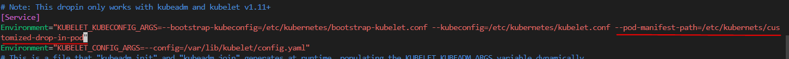
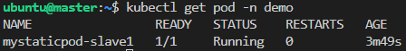
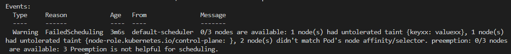

# Pod Management

## Create Pod
- Create pod with command
    ```bash
$> kubectl run <pod_name> --image=<image_name>
    # for example
    $> kubectl run mynginx --image=nginx
    ```
- Create pod with yaml
    ```bash
    # Get yaml template with `--dry-run=client`
    $> mkdir pods && cd pods
    $> kubectl run mynginx --image=nginx --dry-run=client -o yaml > mynginx.yaml 
    $> kubectl create ns demo
    # create pod with yaml
    $> kubectl apply -f mynginx.yaml
    ```
    - mynginx.yaml
        ```yaml
        apiVersion: v1
        kind: Pod
        metadata:
            creationTimestamp: null
            labels:
                run: mynginx
            name: mynginx
            namespace: demo  # <- add demo namespace
        spec:
            containers:
            - image: nginx
              name: mynginx
              resources: {}
              imagePullPolicy: IfNotPresent  # <- add pull policy
            dnsPolicy: ClusterFirst
            restartPolicy: Always
        status: {}
        ```
- Create Pod with 2 containers
    - pod_with_2_containers.yaml
        ```yaml
        apiVersion: v1
        kind: Pod
        metadata:
            creationTimestamp: null
            labels:
                run: pod2c
            name: pod2c
            namespace: demo
        spec:
            containers:
            - image: nginx
              name: mynginx
              resources: {}
              imagePullPolicy: IfNotPresent
            - image: redis  # <- add second container here
              name: myredis
            dnsPolicy: ClusterFirst
            restartPolicy: Always
        status: {}
        ```
- Pod with init Container
    ```bash
    # show vm.swappiness on slave1
    slave1 $> sysctl -n vm.swappiness  # show 60
    master $> kubectl apply -f initpod.yaml
    slave1 $> sysctl -n vm.swappiness  # show 10
    ```
    - initpod.yaml
        ```yaml
        apiVersion: v1
        kind: Pod
        metadata:
            creationTimestamp: null
            labels:
                run: initpod
            name: initpod
            namespace: demo
        spec:
            containers:
            - image: nginx
              name: nginxafterinit
              resources: {}
              imagePullPolicy: IfNotPresent
            
            initContainers:
            - image: alpine
              name: initnginx
              command: ["/bin/sh", "-c", "/sbin/sysctl -w vm.swappiness=10"]  # set swappiness in physical host
              securityContext:
                privileged: true  # because we modified the system variable on physical host, we need to give the privilege for the pod

            dnsPolicy: ClusterFirst
            restartPolicy: Always
        status: {}
        ```

- Create Pod with init Container, both of them shared the same data
    ```bash
    master $> kubectl apply -f initpod2.yaml
    master $> kubectl exec initpod2 -c nginxafterinit2 -- ls /xx  # show a.txt
    ```
    - initpod2.yaml
        ```yaml
        apiVersion: v1
        kind: Pod
        metadata:
            creationTimestamp: null
            labels:
                run: initpod2
            name: initpod2
            namespace: demo
        spec:
            volumes:  # <- define a volume
            - name: workdir
              emptyDir: {}

            containers:
            - image: nginx
              name: nginxafterinit2
              resources: {}
              imagePullPolicy: IfNotPresent
              volumeMounts:
              - name: workdir
                mountPath: "/xx"  # define workdir to /xx in nginx container

            initContainers:
            - image: busybox
              name: bb
              command: ["sh", "-c", "touch /work-dir/a.txt"]
              volumeMounts:
              - name: workdir
                mountPath: "/work-dir"

            dnsPolicy: ClusterFirst
            restartPolicy: Always
        status: {}
        ```
    
    - Create Static Pod

        Static Pods are managered directly by the kubelet on a specific node. We demo how to create static pod on slavem, because the cluster crush if msater node got error. Firstly, check the kubelet status and get the path of config file
        ```bash
        slave $> sudo systemctl status kubelet
        ```
        
        
        If you want to customize static pod, you can put your yaml file in default path `/etc/kubernetes/manifests`. \
        Besides, we can change manifests path by editing 10-kubeadm.conf. 
        1. Add `--pod-manifest-path=/etc/kubernetes/customized-drop-in-pod/` in the first environment variable.
            
        
        2. Now, reload daemon and restart kubelet.
            ```bash
            slave $> sudo systemctl daemon-reload
            slave $> sudo sytemctl restart kubelet
            ```
        3. Create our customized static pod
            ```
            slave $> mkdir /etc/kubernetes/customized-drop-in-pod
            slave $> cd /etc/kubernetes/customized-drop-in-pod
            slave $> vim mystaticpod.yaml
            ```
            - mystaticpod.yaml
                ```yaml
                apiVersion: v1
                kind: Pod
                metadata:
                    namespace: demo  # <- add demo namespace
                    labels:
                        run: mystaticpod
                    name: mystaticpod
                spec:
                    containers:
                    - image: nginx
                    name: mystaticpod
                    dnsPolicy: ClusterFirst
                    restartPolicy: Always
                status: {}
                ```
        4. Log in master node, and we created namespace demo for mystaticpod. Let's check mystaticpod info below.
        
        5. Notice that we removed mystaticpod.yaml in slave, the pod will be delete immediately.

- Create pod on specific nodes

  1. List node with labels
    ```bash
    master $> kubectl get nodes --show-labels
    ```
  2. Add label to slave2
    ```bash
    master $> kubectl label node slave2 jobtype=demo
    # check label is correctly added to slave2
    master $> kubectl get nodes slave2 --show-label
    # delete label (not now, because we need this label to practice)
    master $> kubectl label node slave2 jobtype-
    ```
  3. Create podlabel by applying podlabel.yaml
    ```bash
    master $> kubectl apply -f podlabel.yaml
    ```
    - podlabel.yaml
    ```yaml
    apiVersion: v1
    kind: Pod
    metadata:
      labels:
        run: podlabel
      name: podlabel
    spec:
      nodeSelector:  # <- add nodeSelector
        jobtype: demo 
      containers:
      - image: nginx
        name: podlabel
    status: {}
    ```
  4. Check podlabel run on slave2
    ```bash
    master $> kubectl get pod -o wide
    ```

## Check Pod status
- Check pod with namespace
    ```bash
    # Check pod with namespace
    $> kubectl get pod -n demo
    ```
- Switch Namespace to `demo`
    - ref: https://kubernetes.io/docs/concepts/overview/working-with-objects/namespaces/

    ```bash
    # Switch Namespace to demo (https://kubernetes.io/docs/concepts/overview/working-with-objects/namespaces/)
    $> kubectl config set-context --current --namespace=demo
    # Validate namespace
    $> kubectl config view | grep namespace
    # Check pod
    $> kubectl get pod
    ```
- Check pod with node info
    ```bash
    # check which node ran this pod
    $> kubectl get pods -o wide
    ```
- Check pod with label
    ```bash
    $> kubectl get pods --show-labels
    ```
- Check pod with specific label name
    ```
    $> kubectl get pod -l run=mynginx
    ```

## Delete Pod
- Delay deletion
    ```bash
    # Waiting for terminationGracePeriodSeconds(30s by defaulted)
    $> kubectl delete pod <pod_name>
    ```
- Forcely delete (without delay)
    ```bash
    $> kubectl delete pod <pod_name> --force
    ```

- Set `terminationGracePeriodSeconds` in yaml

    Create `busybox.yaml` as below. It will wait 15s after executing the command to delete busybox.
    ```bash
    $> kubectl apply -f busybox.yaml
    $> kubectl delete pod busybox  # wait for 15s
    ```
    - busybox.yaml
        ```yaml
        apiVersion: v1
        kind: Pod
        metadata:
            creationTimestamp: null
            labels:
                run: busybox
            name: busybox
            namespace: demo
        spec:
            terminationGracePeriodSeconds: 15  # <- set delay deletion in seconds
            containers:
            - image: busybox
              command: ["sh", "-c", sleep 1000]
              imagePullPolicy: IfNotPresent
            dnsPolicy: ClusterFirst
            restartPolicy: Always
        status: {}
        ```
- Special Case

    However, nginx control the quit signal by itself, so nginx is not waiting for `terminationGracePeriodSeconds`. That is, the pod will be delete when nginx was quit itself.
    ```bash
    $> kubectl apply -f mynginx2.yaml
    $> kubectl delete pod mynginx2  # The pod will be delete when nginx was quit. It will not wait for 600s
    ```
    - mynginx2.py
        ```yaml
        apiVersion: v1
        kind: Pod
        metadata:
            creationTimestamp: null
            labels:
                run: mynginx2
            name: mynginx2
            namespace: demo
        spec:
            terminationGracePeriodSeconds: 600
            containers:
            - image: nginx
              name: mynginx2
              resources: {}
              imagePullPolicy: IfNotPresent
            dnsPolicy: ClusterFirst
            restartPolicy: Always
        status: {}
        ```

## Maintain Node

- Cordon

  Use cordon to mark the node unschedulable.

  For practice, we use deployment to deploy pod on each node.
  ```bash
  master $> kubectl create deployment mydeploy --image=nginx --dry-run=client -o yaml > d1.yaml
  # After modified number of replicas to 3
  master $> kubectl apply -f d1.yaml
  # list pod with node info
  master $> kubectl get pod -o wide
  ```
  - d1.yaml
    ```yaml
    apiVersion: apps/v1
    kind: Deployment
    metadata:
    creationTimestamp: null
    labels:
        app: mydeploy
    name: mydeploy
    spec:
    replicas: 3  # <- modified to 3 replicas
    selector:
        matchLabels:
        app: mydeploy
    strategy: {}
    template:
        metadata:
        creationTimestamp: null
        labels:
            app: mydeploy
        spec:
        containers:
        - image: nginx
            name: nginx
            resources: {}
    status: {}
    ```

  Now, we cordon slave2 unschedulable. That is, if we scaled 3 new pods, all of them were deployed on slave1. Notice that those pods on slave2 were still runing.
  ```bash
  master $> kubectl cordon slave2
  # Show node status
  master $> kubectl get node
  master $> kubectl scale deployment mydeploy --replicas=6
  # The 3 of new pods were deployed on slave1
  master $> kubectl get pod -o wide
  ```

- Drain
  
  Cordon and drain are similar. When we drain the target node, it not only makes the node unschedulable but also deletes the pods on the node. 
  ```bash
  # Use the same d1.yaml above
  master $> kubectl apply -f d1.yaml
  # List pods with node info
  master $> kubectl get pod -o wide
  # Drain slave2
  master $> kubectl drain slave2 --ignore-daemonsets --force
  # List pods with node info, the pods on slave2 will be delete, and then be re-deploy on other nodes.
  master $> kubectl get pod -o wide
  ```

- [Taint](https://kubernetes.io/docs/concepts/scheduling-eviction/taint-and-toleration/)

  Taints and tolerations work together to ensure that pods are not scheduled onto inappropriate nodes. One or more taints are applied to a node; this marks that the node should not accept any pods that do not tolerate the taints.
  - Practice1: Set taint on slave1
   
    Let's create some pods for practice
    ```bash
    # d1.yaml was defined above
    $> kubectl apply -f d1.yaml
    # Pods ran on slave1 and slave2
    $> kubectl get pod -o wide
    ```
    Set taint on slave1
    ```bash
    $> kubectl taint nodes slave1 keyxx=valuexx:NoSchedule
    # chec slave1 info
    $> kubectl describe node slave1 | grep -iE '(taint|role)'
    # re-deploy mydeploy (create by d1.yaml)
    $> kubectl scale deploy mydeploy --replicas=0
    $> kubectl scale deploy mydeploy --replicas=3
    # because no pod tolerate the taints on slave1, so all pods were running on slave2
    $> kbuectl get pod -o wide
    ```
  
  - Practice2: Create Pod with torelations
    
    Label jobtype=slave1 to slave1
    ```
    $> kubectl label node slave1 jobtype=slave1
    ```

    Create pod without torelerations and assign it to tainted slave1.
    ```bash
    $> kubectl apply -f podtolerations.yaml
    # You will see pod status is pending
    $> kubectl get pod podto
    # Check error message
    $> kubectl describe pod podto
    ```

    

    - podtolerations.yaml
    ```yaml
    apiVersion: v1
    kind: Pod
    metadata:
      name: podto
      labels:
        role: myrole
    spec:
      nodeSelector:  # <- add nodeSelector
        jobtype: slave1
      containers:
        - name: web
        image: nginx
        imagePullPolicy: IfNotPresent
    ```

    Fix error by adding tolerations in podtolerations.yaml
    - podtolerations.yaml
    ```yaml
    apiVersion: v1
    kind: Pod
    metadata:
      name: podto
      labels:
        role: myrole
    spec:
      nodeSelector:
        jobtype: slave1
      tolerations:  # <- Set tolerations and operator is equal, all key-value must be matched on taints).
      - operator: 'Equal' 
        key: 'keyxx'
        value: 'valuexx'
        effect: 'NoSchedule'
      containers:
        - name: web
        image: nginx
        imagePullPolicy: IfNotPresent
    ```
    Delete podto and recreate it.
    ```bash
    $> kubectl delete pod podto
    $> kubectl apply -f podtolerations.yaml
    # Podto successfully ran on slave1
    $> kubectl get pod podto
    ```
    Untaint slave1
    ```bash
    $> kubectl taint node slave1 keyxx-
    ```
