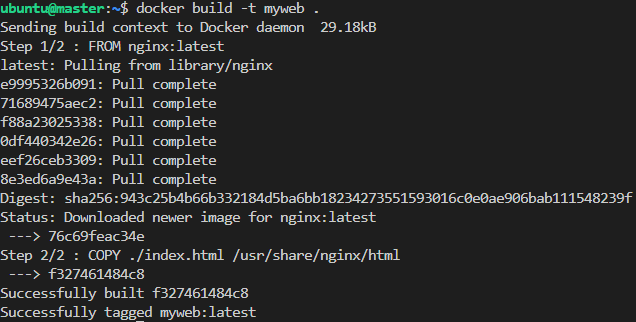
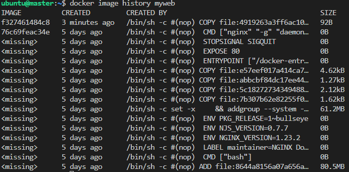

# Usage:
```commandline
# Create a cluster with 3 node, all of them are used containerd as CRI
$> setup_k8s_cluster.ps1 3 
```
[link](../../chap03/README.md)


# Ref:
- K8S with containerd:
  - pre-request: https://kubernetes.io/docs/setup/production-environment/container-runtimes/
  - https://kubernetes.io/docs/setup/production-environment/container-runtimes/#containerd
  - https://github.com/containerd/containerd/blob/main/docs/getting-started.md

- Change container runtime on a Node from Docker engine to Containerd 
  - https://kubernetes.io/docs/tasks/administer-cluster/migrating-from-dockershim/change-runtime-containerd/


# ContainerD tutorial
- Install multipass
- Create a VM for practice
  ```bash
  $> multipass launch --name master -m 4G -c 3 -d 15G
  ```
- Login master
  ```bash
  $> multipass exec master -- bash
  ```
- Install Docker and Containerd
  ```bash
  # 1. Install necessary package
  master $> sudo apt-get update
  master $> sudo apt-get install \
              ca-certificates \
              curl \
              gnupg \
              lsb-release

  # 2. Add Docker’s official GPG key:
  master $> sudo mkdir -p /etc/apt/keyrings
  master $> curl -fsSL https://download.docker.com/linux/ubuntu/gpg | sudo gpg --dearmor -o /etc/apt/keyrings/docker.gpg

  # 3. Add repository to our host
  master $> echo \
  "deb [arch=$(dpkg --print-architecture) signed-by=/etc/apt/keyrings/docker.gpg] https://download.docker.com/linux/ubuntu \
  $(lsb_release -cs) stable" | sudo tee /etc/apt/sources.list.d/docker.list > /dev/null
  master $> sudo apt-get update

  # 4. Install Docker and Containerd
  master $> sudo apt-get install docker-ce docker-ce-cli containerd.io
  ```

Build Case Study Image
- index.html
  ```html
  <html>
    <title>Simple Case Study</title>
    <body>
            Hello World
    </body>
  </html>
  ```

- Dockerfile
  ```dockerfile
  FROM nginx:latest

  COPY ./index.html /usr/share/nginx/html
  ```
- Build image
  ```
  $> docker build -t myweb .
  ```
  

  
  

- Save myweb image myweb.tar
https://stackoverflow.com/questions/59393496/how-to-run-docker-images-in-containerd-using-ctr-in-cli

https://sweetcode.io/getting-started-with-containerd/


ctr image pull docker.io/hongjunyan/todoapp:v1
ctr run --net-host docker.io/hongjunyan/todoapp:v1 mytodoapp